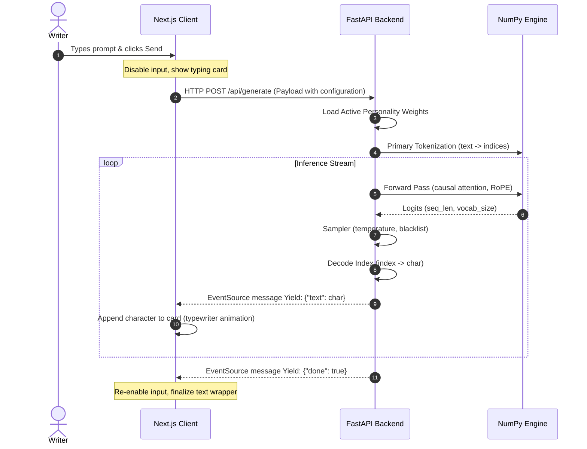
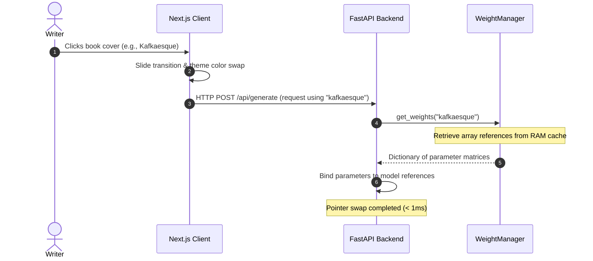
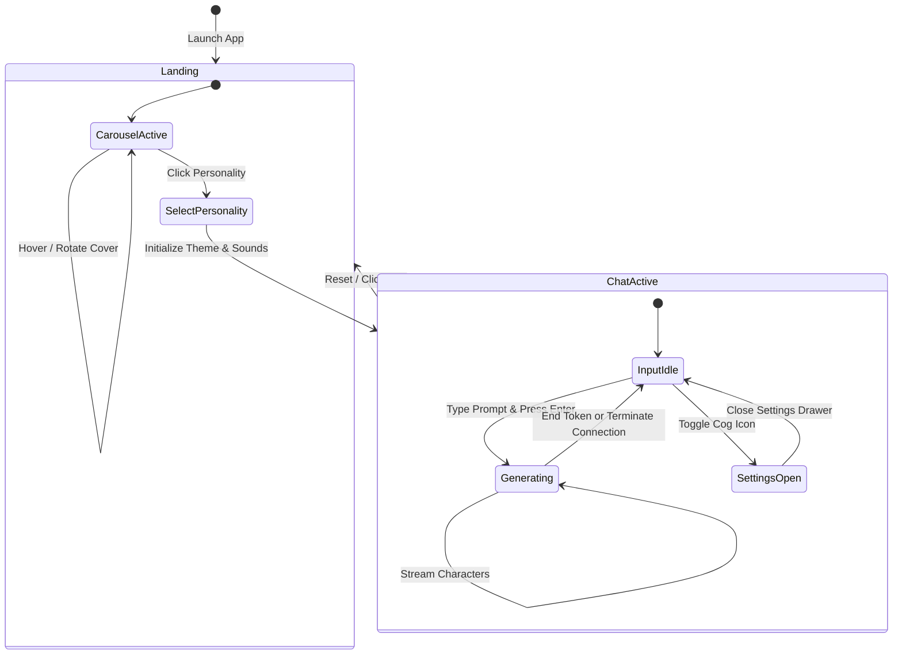

# Pharmakon – Application Flow

This document details the interactive flow of the Pharmakon system, showing the sequences of requests, states, and client-server processing loops.

---

## 1. Sequence Diagram: Text Generation (SSE)

This diagram tracks the lifecycle of a text generation request, showing the streaming mechanics over Server-Sent Events (SSE).

---

## 2. Sequence Diagram: Personality Swapping

This diagram shows how weights are swapped in memory without latency when a user changes their active personality in the UI.

---

## 3. Application State Transitions

